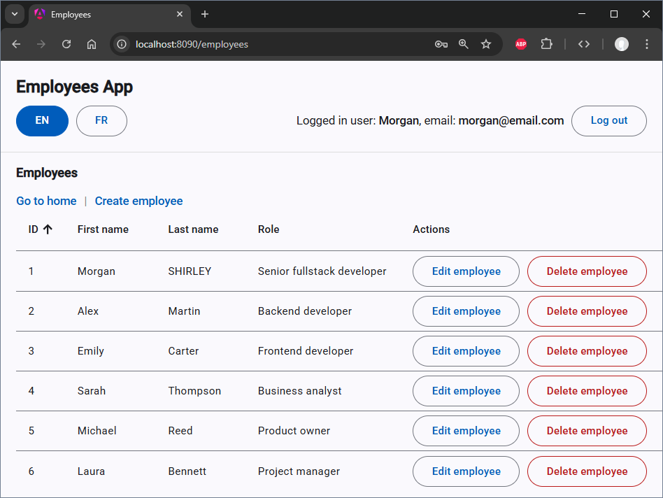

# Fullstack Reference Application (Spring Boot 4 · Java 25 · Angular 20)
[](
https://github.com/MorganShirl/employees-fullstack/actions/workflows/maven.yml
)




---

## 🧭 Who this project is for

- **The Upgrader**: Developers transitioning to the latest Spring Boot and Angular standards.
- **The Architect**: Teams needing a clean, production-ready baseline for new projects.
- **The Minimalist**: Anyone who wants a "no-fluff" setup using modern best practices.

## 🎯 Project Goal

This project is a **minimal but production-oriented reference application** intended to kickstart modern fullstack development.

It demonstrates real-world security concerns, including:

- Session-based authentication
- CSRF / XSRF protection
- CORS vs proxy-based setups between an Angular frontend and a Spring Boot backend

The emphasis is on **clarity, correctness, and modern best practices**, with sensible defaults and configuration files that include **only what is strictly required** for the application to run correctly.

In particular, the POM files, 
[.gitignore](./.gitignore), 
[.editorconfig](./.editorconfig), 
[application.yml](./sb-backend/src/main/resources/application.yml), 
[application-postgres.yml](./sb-backend/src/main/resources/application-postgres.yml), 
[angular.json](./angular-frontend/employees-ui/angular.json), 
[tsconfig.json](./angular-frontend/employees-ui/tsconfig.json), 
[app.config.ts](./angular-frontend/employees-ui/src/app/app.config.ts), 
[styles.scss](./angular-frontend/employees-ui/src/styles.scss) 
are intentionally kept **minimal and explicit**.  

In other words, **there is no dead code**.  

## ℹ️ Project Information

Build tooling is provisioned via the **Maven Wrapper** and a frontend Maven plugin.  
As a result, the **only prerequisite** to build and run the project is a **Java 25 JDK**.

Development was done using **IntelliJ IDEA Ultimate 2025**.  
While other IDEs can be used, **IntelliJ** is recommended, as the repository includes IDE-specific run configurations and database connection files that are referenced in the `Development` section below.

## ✨ Key Features

The project provides a **focused set of features commonly required in real-world production systems**, available from the outset.

It consists of a parent Maven POM and two child modules:
- an Angular frontend
- a Spring Boot backend

During the build, the frontend Maven plugin packages the Angular application directly into the Spring Boot executable JAR.  

The frontend can also be run independently and communicate with the backend, making it possible to explicitly test **CORS** (cross-origin) and **same-origin** (proxy-based) configurations.

### ☕🌱 Backend (Spring Boot 4 / Java 25)
- Two supported databases, selected via Spring profiles:
    - `default`: embedded, file-based H2 (with H2 web console)
    - `postgres`: PostgreSQL via Docker Compose (with pgAdmin web console)
- Caching of read-only HTTP requests using **Caffeine** (see [EmployeeService.java](./sb-backend/src/main/java/com/morgan/backend/services/EmployeeService.java))
- Consistent, structured error handling using Spring `ProblemDetail` and a global `@RestControllerAdvice` (see [GlobalExceptionHandler.java](./sb-backend/src/main/java/com/morgan/backend/exceptions/GlobalExceptionHandler.java))
- Session-based authentication using `JSESSIONID` (see [SecurityConfig.java](./sb-backend/src/main/java/com/morgan/backend/config/SecurityConfig.java) and [AuthenticationController.java](./sb-backend/src/main/java/com/morgan/backend/controllers/AuthenticationController.java))
- HTTP requests handled using **virtual threads** (see [AppInfoController.java](./sb-backend/src/main/java/com/morgan/backend/controllers/AppInfoController.java))
- REST API (see [EmployeeController.java](./sb-backend/src/main/java/com/morgan/backend/controllers/EmployeeController.java)) following proper HTTP semantics (verbs, dto validity, status codes, etc.)
- Actuator endpoints exposed on a **separate port**
- OpenAPI specification with **Swagger UI**
- Centralized CORS configuration allowing cross-origin requests from `http://localhost:4200` (see [application.yml](./sb-backend/src/main/resources/application.yml) and [CorsConfig.java](./sb-backend/src/main/java/com/morgan/backend/config/CorsConfig.java))
- CSRF protection enabled for additional security
- SPA fallback routing (see [SpaForwardFilter.java](./sb-backend/src/main/java/com/morgan/backend/filters/SpaForwardFilter.java)) to support client-side routes (frontend-managed 404s)
- Custom logging configuration with separate application and SQL log files (see [logback-spring.xml](./sb-backend/src/main/resources/logback-spring.xml))
    - Log level for these files are configured centrally in [application.yml](./sb-backend/src/main/resources/application.yml)
    - Each request is tagged with a unique request ID using MDC (see [MdcRequestIdFilter.java](./sb-backend/src/main/java/com/morgan/backend/filters/MdcRequestIdFilter.java))
- Comprehensive testing setup:
    - Unit tests with **Mockito** (see [EmployeeServiceTest.java](./sb-backend/src/test/java/com/morgan/backend/services/EmployeeServiceTest.java))
    - **MockMvc** tests (see [EmployeeControllerTest.java](./sb-backend/src/test/java/com/morgan/backend/controllers/EmployeeControllerTest.java))
    - **Spring Boot integration tests** (see [AppInfoControllerIT.java](./sb-backend/src/test/java/com/morgan/backend/controllers/AppInfoControllerIT.java) and [EmployeeServiceIT.java](./sb-backend/src/test/java/com/morgan/backend/services/EmployeeServiceIT.java))
    - **IntelliJ HTTP Requests** integration tests (see [crud-employees-test.http](.httpRequests/crud-employees-test.http))

### 🅰️ Frontend (Angular 20)
- Clean and predictable directory structure
- TypeScript strict compiler options (see [tsconfig.json](./angular-frontend/employees-ui/tsconfig.json))
- TypeScript path aliases (`@env`, `@core`, `@shared`, `@features`) for readable and maintainable imports (see [tsconfig.json](./angular-frontend/employees-ui/tsconfig.json))
- Angular **signals** for component-level state management (see [employee-list.store.ts](./angular-frontend/employees-ui/src/app/features/employee/pages/list/employee-list.store.ts))
- Standalone components like [employee-list.page.ts](./angular-frontend/employees-ui/src/app/features/employee/pages/list/employee-list.page.ts) that use a dedicated service such as [employee-api.service.ts](./angular-frontend/employees-ui/src/app/core/services/employee-api.service.ts)
- Angular Material integration with view transition effects (e.g. `withViewTransitions`) for smoother navigation (see [app.config.ts](./angular-frontend/employees-ui/src/app/app.config.ts))
- Optional Angular development proxy to demonstrate CORS vs same-origin setups via environment-based configuration (see [environment.ts](./angular-frontend/employees-ui/src/environments/environment.ts), [environment.proxy.ts](./angular-frontend/employees-ui/src/environments/environment.proxy.ts), and [proxy.conf.json](./angular-frontend/employees-ui/proxy.conf.json))
- Client-side custom 404 page (see [not-found.page.html](./angular-frontend/employees-ui/src/app/shared/pages/404/not-found.page.html))
- Automatic restoration of an existing backend session on application startup or page refresh (see `provideAppInitializer` in [app.config.ts](./angular-frontend/employees-ui/src/app/app.config.ts))
- Multilingual support (English and French), including UI text and browser tab titles (see [app.config.ts](./angular-frontend/employees-ui/src/app/app.config.ts) and [i18n-title-strategy.ts](./angular-frontend/employees-ui/src/app/core/i18n/i18n-title-strategy.ts))
- Global HTTP error interceptor (see [error.interceptor.ts](./angular-frontend/employees-ui/src/app/core/interceptors/error.interceptor.ts)) that:
    - maps backend `ProblemDetail` responses
    - logs errors to the console
    - displays user-friendly messages via snackbars (see [notification.service.ts](./angular-frontend/employees-ui/src/app/core/services/notification.service.ts))
- Route guards enforcing authentication and redirecting unauthenticated users to the login page (see [auth.guard.ts](./angular-frontend/employees-ui/src/app/core/guards/auth.guard.ts) and [app.routes.ts](./angular-frontend/employees-ui/src/app/app.routes.ts))
- **XSRF/CSRF** token forwarding via a custom Http interceptor (see [xsrf.interceptor.ts](./angular-frontend/employees-ui/src/app/core/interceptors/xsrf.interceptor.ts)) that reads the XSRF-TOKEN cookie and attaches it as X-XSRF-TOKEN only for backend API calls (supports proxy and CORS setups). 

---

## 🛠️ Development

### 🧱 Building the project
It is better to build the project using the Maven Wrapper to ensure that the correct Maven version is used (see [maven-wrapper.properties](.mvn/wrapper/maven-wrapper.properties)).  

These commands are for Windows:  
```bash
   cd ./employees-fullstack/
```
```bash
   ./mvnw.cmd clean install
```

On a Linux machine you can use:  
```bash
   ./mvnw clean install
```

Or you can use the IntelliJ maven run config:  
👉 [employees-fullstack \[clean,install\]](./.idea/runConfigurations/employees_fullstack__clean_install_.xml)

### ▶️ Running the backend
You can run the backend using the IntelliJ Spring Boot run configurations provided in the `.idea/runConfigurations` folder.  
👉 [SbBackendApplication [default h2]](./.idea/runConfigurations/SbBackendApplication__default_h2_.xml)  
👉 [SbBackendApplication [postgres]](./.idea/runConfigurations/SbBackendApplication__postgres_.xml)

#### Backend endpoint
[http://localhost:8090/](http://localhost:8090/)

#### Predefined users & authentication 
Test users with username/email/password are defined in:  
👉 [AppConfig.java](./sb-backend/src/main/java/com/morgan/backend/config/AppConfig.java)  
When you log in, you will see a `JSESSIONID` cookie in the application tab of Chrome DevTools.  
When you log out, this cookie is removed.

#### Actuator endpoints
[http://localhost:9090/actuator](http://localhost:9090/actuator)  
Also see 👉 [actuator.http](.httpRequests/actuator.http)  
To see the DB caches: [http://localhost:9090/actuator/caches](http://localhost:9090/actuator/caches)

#### Swagger endpoint
[http://localhost:8090/swagger-ui/index.html](http://localhost:8090/swagger-ui/index.html)

#### Virtual threads verification endpoint
[http://localhost:8090/api/info/request-thread](http://localhost:8090/api/info/request-thread)

#### All these endpoints are accessible thanks to 
👉 [SpaForwardFilter.java](./sb-backend/src/main/java/com/morgan/backend/filters/SpaForwardFilter.java)

#### Backend testing via IntelliJ HTTP Requests (backend must be running of course)
You can test the backend by running the IntelliJ httpRequests test suite provided in the `.httpRequests` folder.  
👉 [crud-employees-test.http](.httpRequests/crud-employees-test.http)

#### Run the backend with the postgres profile
To use the PostgreSQL run configuration, make sure Docker Desktop is running, then start the containers:
```bash
   cd ./employees-fullstack/
```
```bash
   docker compose up -d
```
The pgadmin console is available (you have to wait a bit after starting the containers).  
To connect to this console, see the credentials in [application-postgres.yml](./sb-backend/src/main/resources/application-postgres.yml) and [docker-compose.yml](./docker-compose.yml), then go to:  
[http://localhost:5050](http://localhost:5050)

To stop the containers:
```bash
   docker compose down
```

To stop the containers AND delete all data stored in the `postgres-employees-data` Docker volume:
```bash
   docker compose down -v
```

#### Run the backend with the default h2 profile
With the default profile, the data is stored in a h2 db in `./employees-fullstack/data`

The h2 console is available here:  
[http://localhost:8090/h2](http://localhost:8090/h2)

### ▶️ Running the frontend

```bash
   cd ./angular-frontend/employees-ui/
```
[http://localhost:4200/](http://localhost:4200/)

#### 1. Run without the Angular proxy (direct backend calls — CORS enabled)
This mode makes the browser call the backend at `http://localhost:8090` directly from `http://localhost:4200`, so the origins are different.  
You will see real CORS preflight (`OPTIONS`) requests in the network tab of Chrome DevTools.  
If you remove http://localhost:4200 from `app.cors.allowed-origins` in [application.yml](./sb-backend/src/main/resources/application.yml), 
you will see CORS errors.

```bash
   ng serve
```

Or you can run the frontend using the IntelliJ run configuration provided in the `.idea/runConfigurations` folder.  
👉 [employees-ui \[CORS\]](./.idea/runConfigurations/employees_ui__CORS_.xml)

#### 2. Run with the Angular proxy (no CORS)
This mode proxies all /api calls from the Angular dev server to http://localhost:8090,
so the browser never makes cross-origin requests.  
You will see **no** CORS preflight (`OPTIONS`) requests.

This mirrors the behavior obtained when the application is served directly by the backend at http://localhost:8090 after a Maven build.

```bash
ng serve --configuration=proxy
```

Or you can run the frontend using the IntelliJ run configuration provided in the `.idea/runConfigurations` folder.  
👉 [employees-ui \[start proxy - no CORS\]](./.idea/runConfigurations/employees_ui__start_proxy___no_CORS_.xml)

### 🚧 404 handling
http://localhost:8090/api/employees/99  
=> backend 404:  
{"detail":"Could not find employee with id [=99]","instance":"/api/employees/99","status":404,"title":"Resource Not Found"}

http://localhost:8090/employees/99 
=> frontend handles that and returns the custom 404 page from `employees-ui`

http://localhost:8090/notExist
=> frontend handles that and returns the custom 404 page from `employees-ui`

